---

# 🚀 Fastag Fraud Detection using Machine Learning 🤖

## 🗂️ Project Structure

1. **Problem Statement**
2. **Model Development**
3. **Model Deployment**
4. **Real-World Implementations**

---

## 📝 Problem Statement

The goal is to create a robust model that can accurately identify instances of fraudulent activity, ensuring the integrity and security of Fastag transactions.

**Dataset Features:**
- **Transaction_ID**: Unique identifier for each transaction
- **Timestamp**: Date and time of the transaction
- **Vehicle_Type**: Type of vehicle involved in the transaction
- **FastagID**: Unique identifier for Fastag
- **TollBoothID**: Identifier for the toll booth
- **Lane_Type**: Type of lane used for the transaction
- **Vehicle_Dimensions**: Dimensions of the vehicle
- **Transaction_Amount**: Amount associated with the transaction
- **Amount_paid**: Amount paid for the transaction
- **Geographical_Location**: Location details of the transaction
- **Vehicle_Speed**: Speed of the vehicle during the transaction
- **Vehicle_Plate_Number**: License plate number of the vehicle
- **Fraud_indicator**: Binary indicator of fraudulent activity (Target variable)

---

## 📊 Exploratory Data Analysis

- **Missing Data**: 10.98% missing in FastagID.
- **Vehicle Speed**: Approximately normal distribution.
- **Transaction Amount vs. Amount Paid**: No difference for non-fraudulent transactions.
- **Feature Relationship**: Only Vehicle_Dimensions showed some relationship with fraud categories.

---

## 🏗️ Feature Engineering and Selection

- **New Feature**: `Amount_Frauded` derived from `Transaction_Amount` and `Amount_paid`.
- **Selected Features using Lasso Regularization**: `Vehicle_Type`, `Vehicle_Dimensions`, `Geographical_Location`, `Amount_Frauded`.

---

## 🛠️ Model Development

- **Best Model**: Random Forest Classifier
- **Performance**: Achieved a perfect accuracy of 1.00 on the test data.

---

## ☁️ Model Deployment

**Steps to Deploy on Render Cloud Service:**

1. Select and save the best model and preprocessor as pickle files by running `model.py`.
2. Create a Flask app and list dependencies in `requirements.txt`.
3. Connect a cloud database using `.env` file.
4. Upload all files to a GitHub repository.
5. Connect the GitHub repository to Render cloud service.
6. Deploy the app to get a URL for the Flask app.

💻 **ML App**: [Fastag Fraud Detection API](https://fastag-fraud-detection-api.onrender.com)

---

## 🌐 Real-World Implementations

- **Instant Classification**: Classify any transaction instantly and store the data with a fraud indicator.
- **Fines**: Assign fines directly to the vehicle owner using the license plate number.
- **Analysis**: Analyze vehicle plate numbers with the highest fraudulent transactions.
- **Suspensions**: Suspend Fastag IDs of frequently involved vehicles to reduce financial loss.

---
## 🎯 Project Presentation

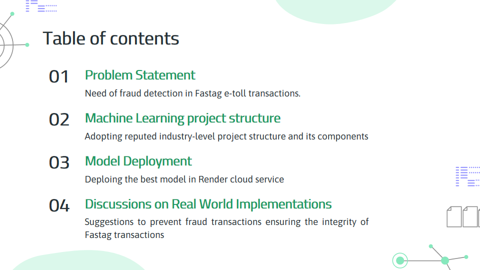
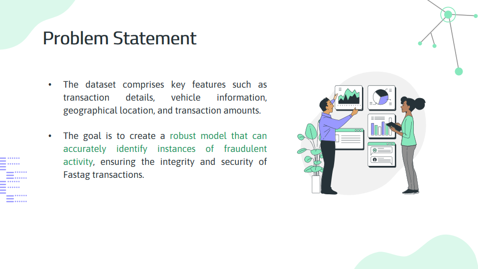
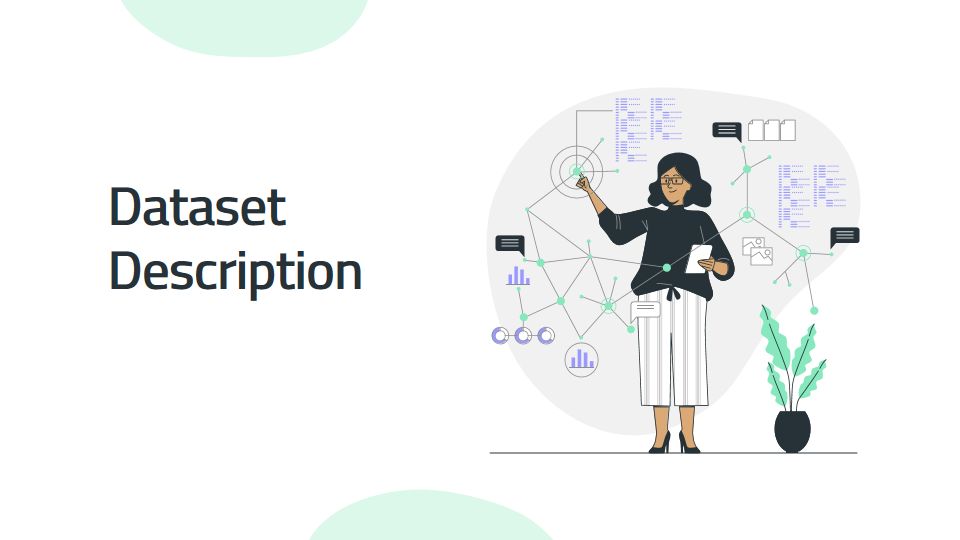
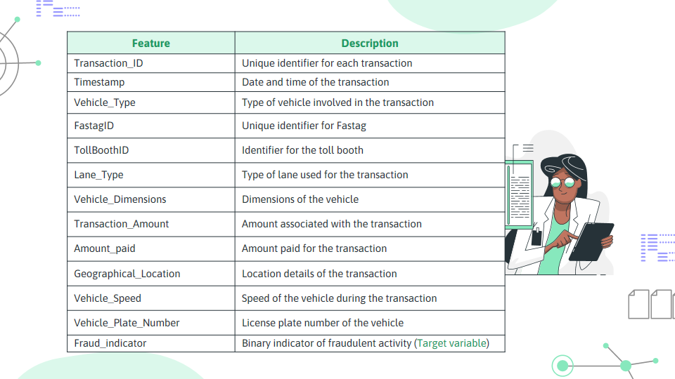
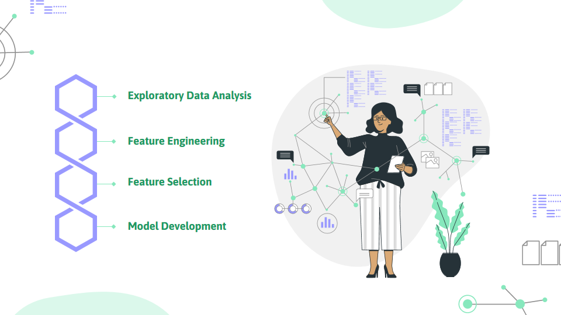
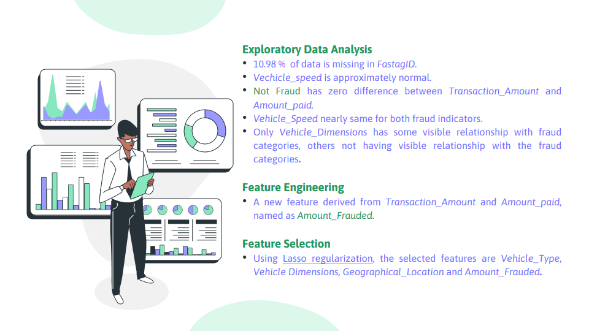

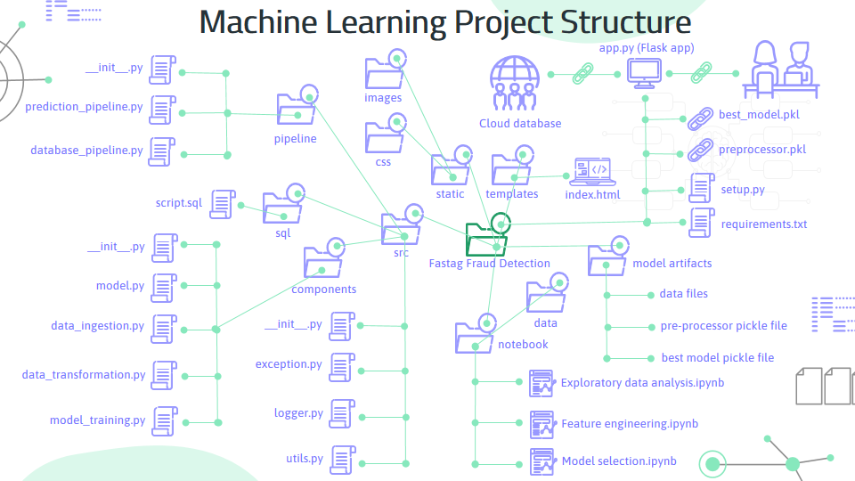

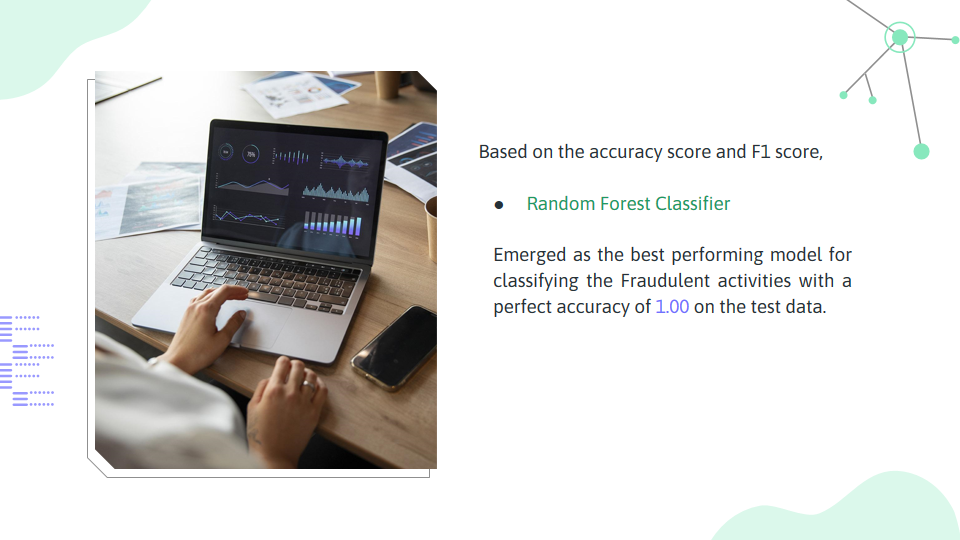

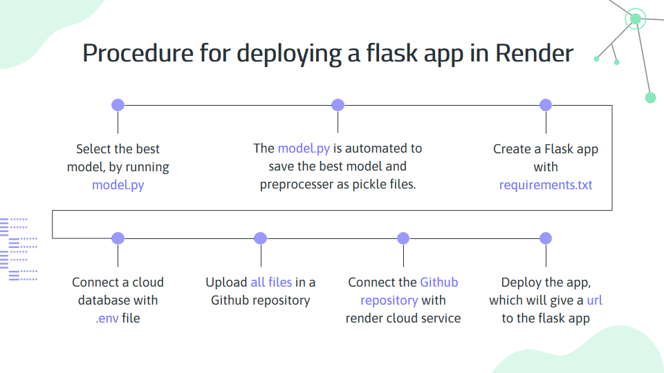
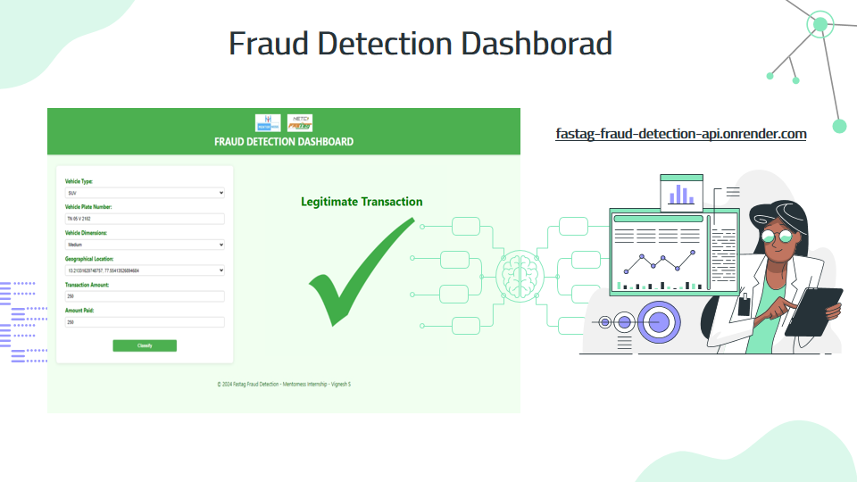

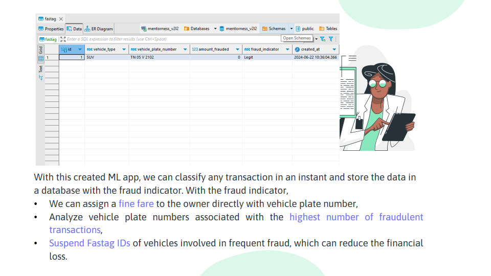

---
## 📞 Contact

**Vignesh S**  
**Email**: vivic210202@gmail.com  
**Phone**: +91 90253 77693

---

Feel free to contribute, open issues, and submit pull requests! 🎉
